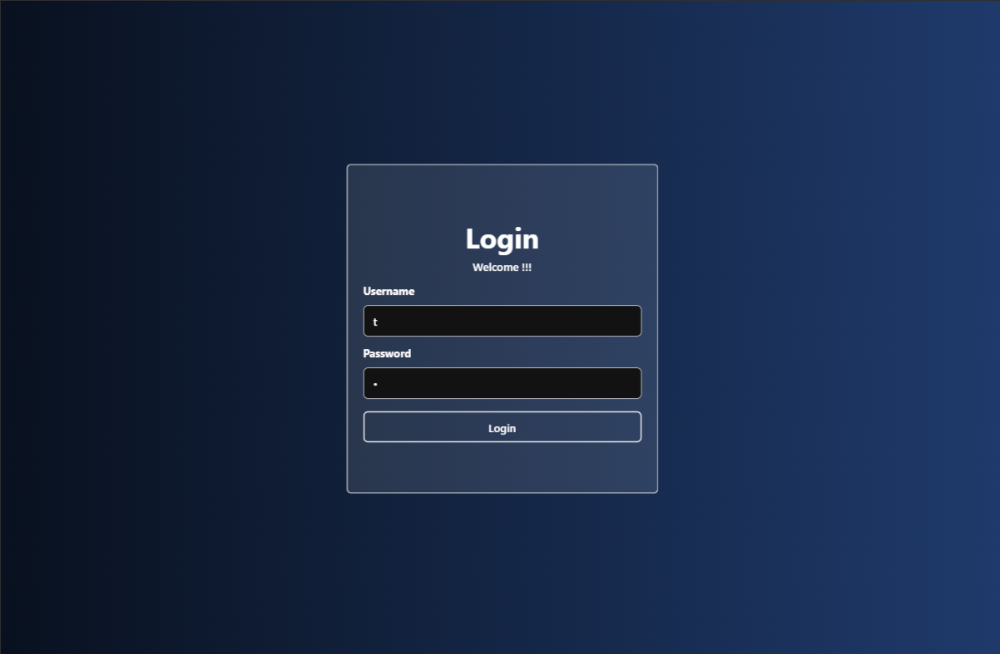
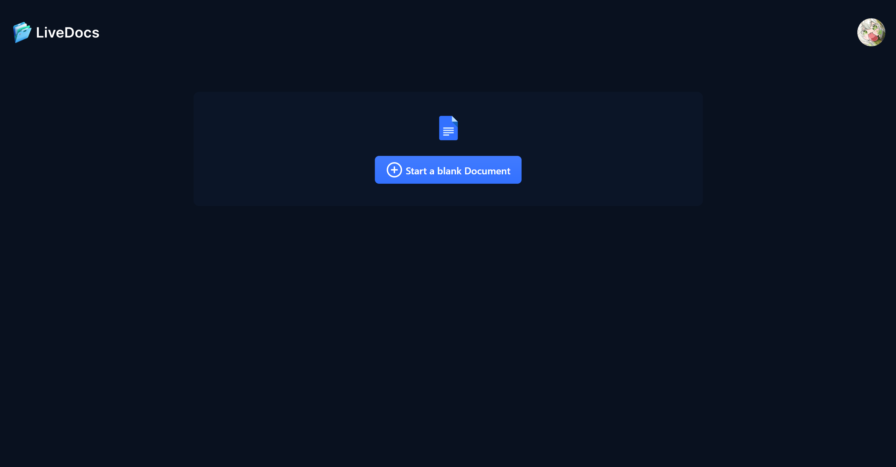
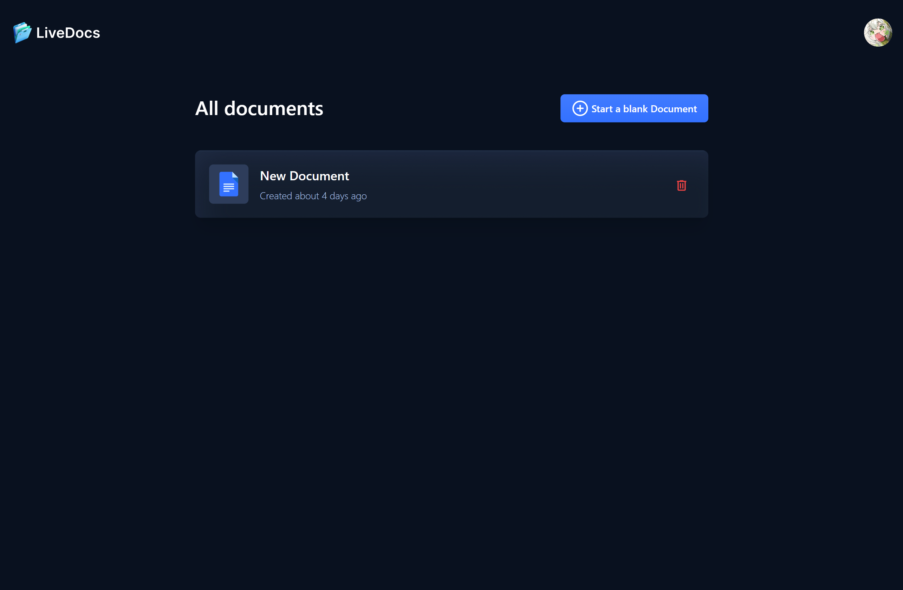
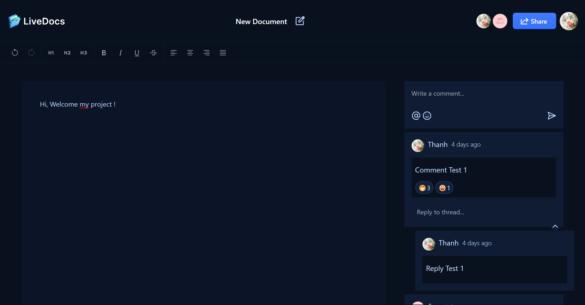
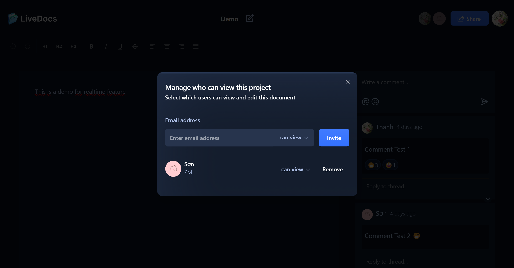
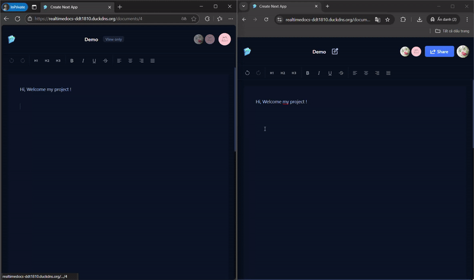

# A Collaborative LiveDoc

Collaborative LiveDoc là trình soạn thảo văn bản cộng tác theo thời gian thực.

## 📋 <a name="table">Mục lục</a>

1. 🤖 [Introduction](#introduction)
2. ⚙️ [Tech Stack](#tech-stack)
3. 🔋 [Features](#features)
4. 🚀 [Images](#images)
5. 🔗 [Links](#demo)

## <a name="introduction">🤖 Introduction</a>

Được xây dựng với Next.js để xử lý giao diện người dùng, được tạo kiểu bằng TailwindCSS và xây dựng server api và websocket với Python FastAPI. LiveDocs đươc lấy cảm hứng từ Google Docs với mục tiêu chính là thể hiện các kỹ năng xử lý thời gian thực.

## <a name="tech-stack">⚙️ Tech Stack</a>

**Client:** NextJs, TypeScript, TailWind CSS, ShadCN, Lexical Editor

**Server:** FastAPI, Redis

**Deployment:** Docker, Google Cloud VPS

## <a name="features">🔋 Features</a>

👉 **Authentication**: Đăng nhập bằng tài khoản với hình thức xác thực Auth JWT. Quản lý phiên đăng nhập với redis giới hạn đăng nhập đồng thời.

👉 **Collaborative Text Editor**: Thư viện cung cấp công cụ chỉnh sửa văn bản cơ bản.

👉 **Documents Management**

- **Create Documents**: Người dùng có thể tạo và lưu tài liệu vào cơ sở dữ liệu.
- **Delete Documents**: Người dùng có thể xóa tài liệu mà họ sở hữu.
- **Share Documents**: Người dùng có thể chia sẻ tài liệu qua email và cung cấp quyền xem/chỉnh sửa.
- **List Documents**: Hiển thị tất cả các tài liệu được sở hữu hoặc chia sẻ với người dùng, với các chức năng tìm kiếm và sắp xếp.

👉 **Comments**: Người dùng có thể bình luận tài liệu hoặc nhận xét các bình luận khác.

👉 **Active Collaborators on Text Editor**: Hiển thị cộng tác viên đang hoạt động với các chỉ báo hiện diện theo thời gian thực.

👉 **Compatibility**: Giao diện thích ứng trên tất cả thiết bị.

## <a name="images">🚀Images</a>

- Login Page
  
- Home Page
  
  
- Document Page
  
- Share Feature
  
- Live edit
  

## <a name="demo">🔗 Live Demo</a>

- Live Demo [here](https://realtimedocs-ddt1810.duckdns.org)

**user test 1:**

- username: t
- password: t

**user test 2:**

- username: t2
- password: t
